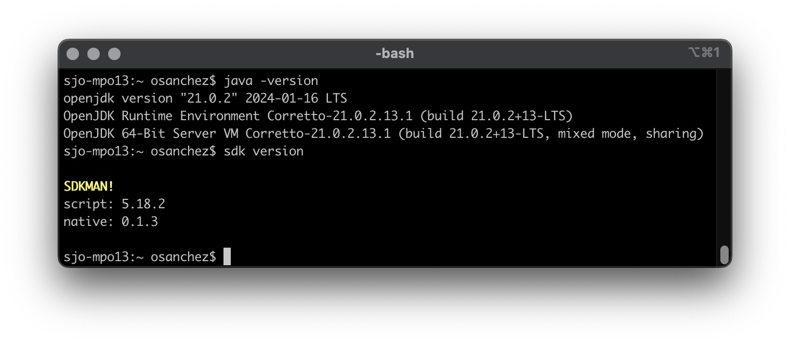
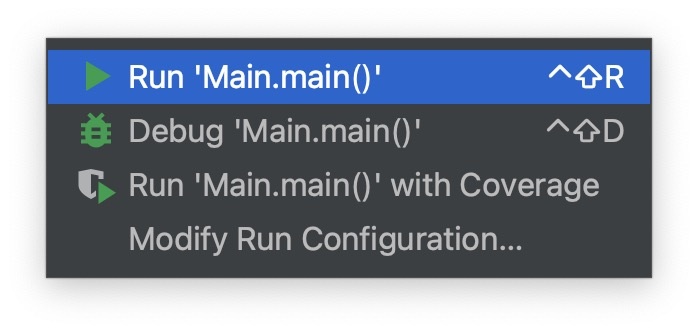
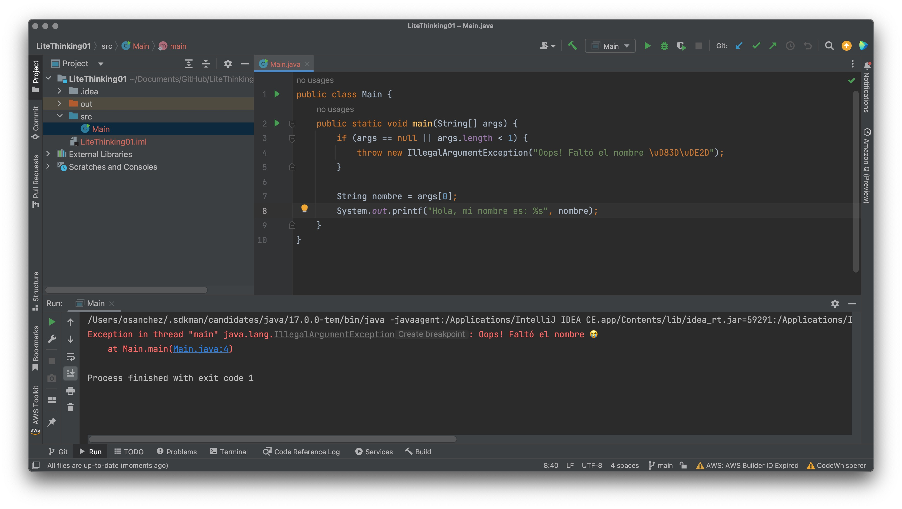
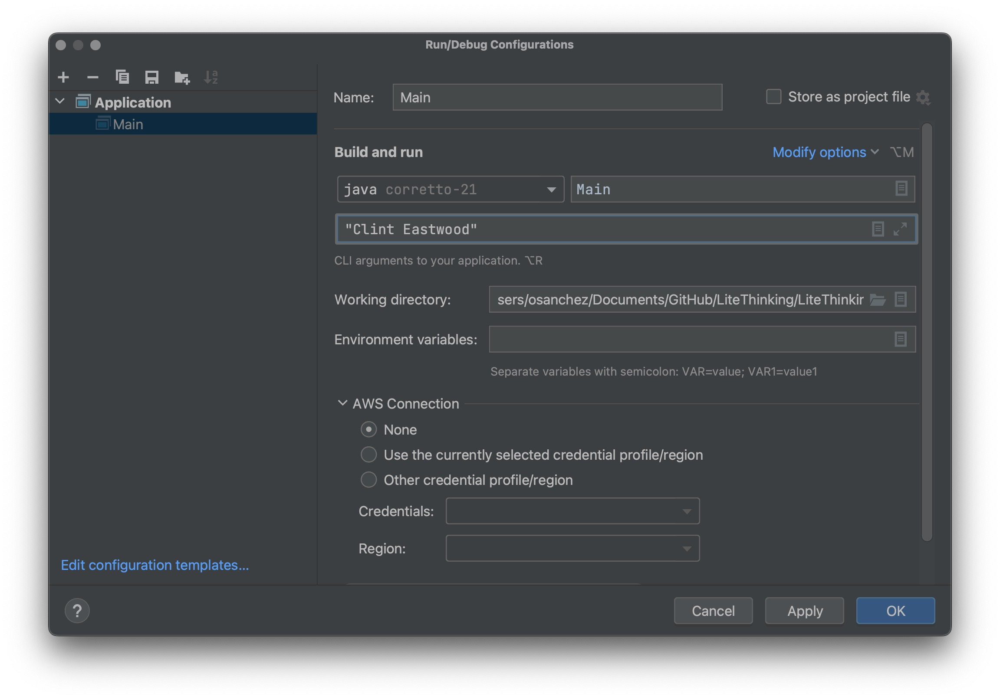
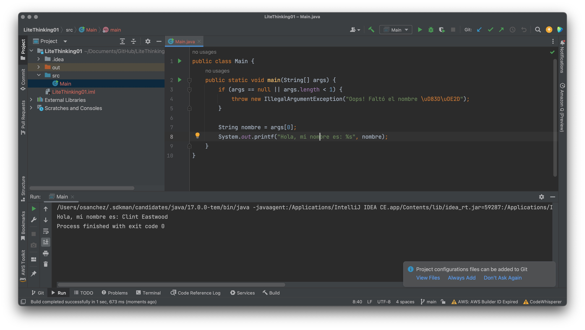

# Hello World!

## Execution

Para ir por lo más sencillo, usamos Run/Debug Configurations de IntelliJ 😄

### Paso 1

Instalar el Java más reciente via [SDKMAN!](https://sdkman.io/)

### Paso 2

Correrlo desde el IDE

### Paso 3

Falla, ya que no hay parámetro de "nombre"

### Paso 4

Setear el nombre en el Run/Debug config

### Paso 5

Hola hola

